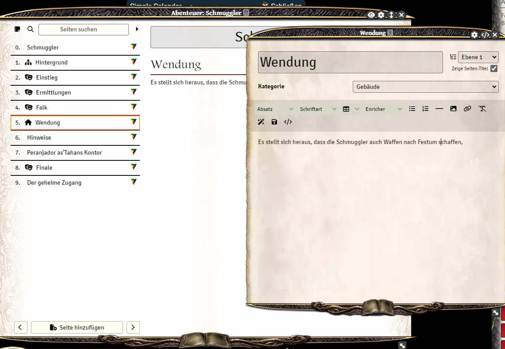

# Journal Categories

This module allows you to add customizable categories to any journal entry. Each category is represented by an icon displayed next to the page title in the sidebar.

The module integrates with [Extended Journal Links](https://github.com/Muwak77/journal-backlinks-extended) to display category icons in backlink references.

## Settings

- **Categories**: A semicolon-separated list of category names.
- **Icons**: A semicolon-separated list of FontAwesome icon classes for each category.